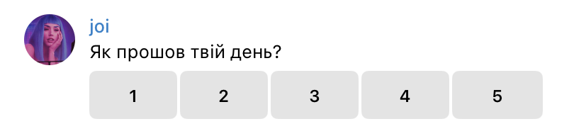

<h2>Rate Your Day - Telegram bot</h2>

Evaluate your day in a convenient way using telegram bot

  

## How it works
* Start chatting with telegram bot - https://t.me/rate_your_day_bot
* Bot will greet you  and ask you what is the most convenient time to write you

* Every night, at specified time bot will ask you how was your day:

* Rate your day from 1 to 5:

* Every Monday bot will send you visualized results of past week:

* Every 1st day of the month bot will send you visualized results of past month:
  
* Spend few minutes to understand what made your greatest days so great and what made your worst days so bad.

P.S. Telegram bot is absolutely free.

P.S. Telegram bot is stylized as a Joi from **Blade Runner 2049** just for fun.

## Contacts

- [@tymofiivoitenko](https://github.com/tymofiivoitenko1)
